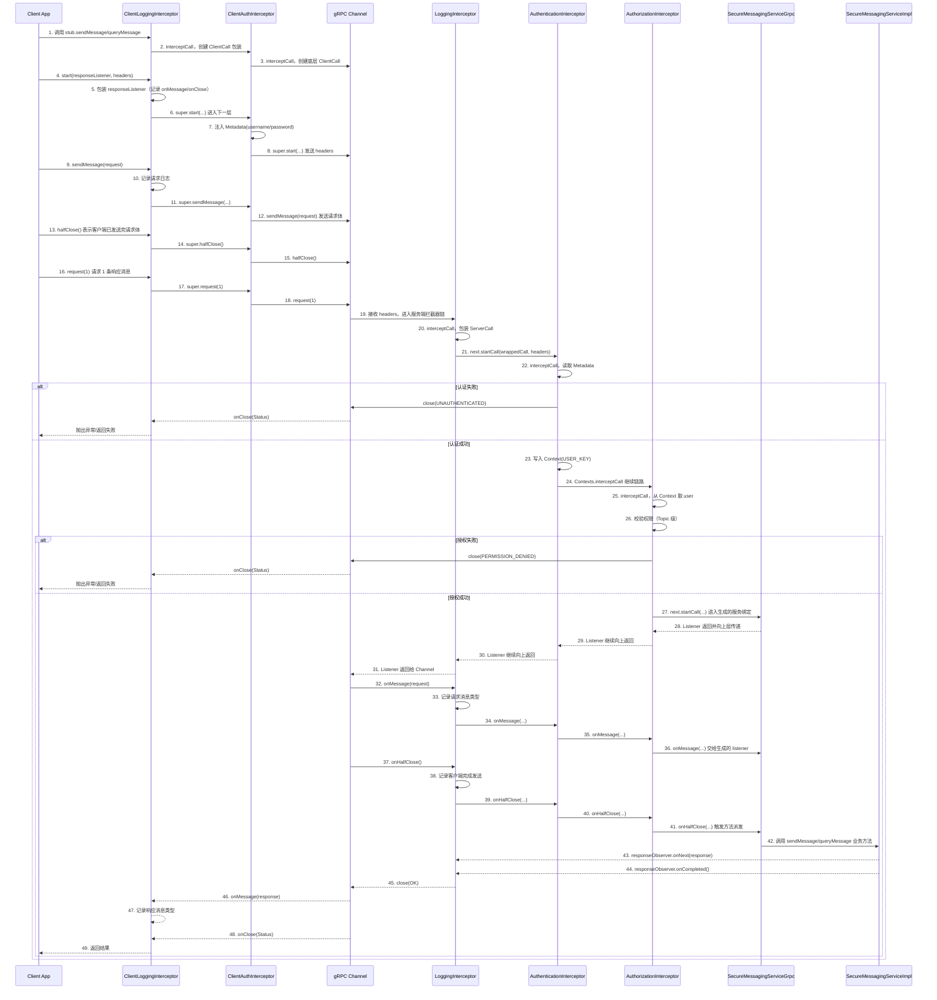

# Example 3: 拦截器

通过一个“安全消息服务”的小例子，理解 gRPC 拦截器机制、认证授权流程，以及 Context 在拦截器链路中的传递方式。

## 运行

```bash
mvn clean compile

# 终端 1：启动服务端
mvn exec:java -Dexec.mainClass="com.example.SecureMessagingServer"

# 终端 2：运行客户端
mvn exec:java -Dexec.mainClass="com.example.SecureMessagingClient"
```

客户端会自动执行三组测试：
1. 正确账号（可成功发送和查询）
2. 错误密码（认证失败）
3. 缺少认证信息（认证失败）

## 学习内容

### 1. 拦截器链路与执行顺序
服务端拦截器从后往前处理请求、从前往后处理响应：

```
request:  LoggingInterceptor
          -> AuthenticationInterceptor
          -> AuthorizationInterceptor
          -> Service
response: Service
          -> AuthorizationInterceptor
          -> AuthenticationInterceptor
          -> LoggingInterceptor
```

对应代码：
```java
ServerInterceptors.intercept(
    service,
    new AuthorizationInterceptor(),
    new AuthenticationInterceptor(),
    new LoggingInterceptor()
)
```

### 2. 完整调用链路（Mermaid）
下面是一次 RPC 调用的完整链路，从客户端到服务端，再回到客户端。包含拦截器、Metadata、Context、响应状态和生命周期回调。



### 3. Metadata 传递认证信息
客户端拦截器在发送请求前写入 `Metadata`：
```java
headers.put(Metadata.Key.of("username", Metadata.ASCII_STRING_MARSHALLER), username);
headers.put(Metadata.Key.of("password", Metadata.ASCII_STRING_MARSHALLER), password);
```

服务端拦截器读取并验证：
```java
String username = headers.get(Metadata.Key.of("username", Metadata.ASCII_STRING_MARSHALLER));
String password = headers.get(Metadata.Key.of("password", Metadata.ASCII_STRING_MARSHALLER));
```

### 4. Context 在拦截器之间传递信息
认证通过后，将用户名写入 `Context`，后续拦截器和服务可以读取：
```java
Context context = Context.current().withValue(AuthenticationInterceptor.USER_KEY, username);
return Contexts.interceptCall(context, call, headers, next);
```

### 5. 认证 vs 授权
- **AuthenticationInterceptor**：判断“你是谁”
- **AuthorizationInterceptor**：判断“你能做什么”

在示例里，授权逻辑简化为检查用户是否拥有某些 Topic 的访问权限。

## 关键代码

- 服务端：`grpc-examples/example3-interceptor/src/main/java/com/example/SecureMessagingServer.java`
- 客户端：`grpc-examples/example3-interceptor/src/main/java/com/example/SecureMessagingClient.java`
- 服务端拦截器：
  - `grpc-examples/example3-interceptor/src/main/java/com/example/interceptor/AuthenticationInterceptor.java`
  - `grpc-examples/example3-interceptor/src/main/java/com/example/interceptor/AuthorizationInterceptor.java`
  - `grpc-examples/example3-interceptor/src/main/java/com/example/interceptor/LoggingInterceptor.java`
- 客户端拦截器：
  - `grpc-examples/example3-interceptor/src/main/java/com/example/interceptor/ClientAuthInterceptor.java`
  - `grpc-examples/example3-interceptor/src/main/java/com/example/interceptor/ClientLoggingInterceptor.java`
- Proto：`grpc-examples/example3-interceptor/src/main/proto/secure_messaging.proto`

## 详细解释（按 gRPC API 维度）

### 服务端拦截器链路

**ServerInterceptor**
- 作用：服务端拦截器接口，允许在请求进入服务实现前做认证、授权、日志、限流等。
- 核心方法：`interceptCall(call, headers, next)`
  - `call`：本次 RPC 调用的控制对象（获取方法名、关闭调用、发响应）。
  - `headers`：客户端传来的 Metadata，类似 HTTP header。
  - `next`：进入下一环节（下一个拦截器或服务实现）。

**ServerCall**
- 作用：服务端对“单次调用”的控制对象。
- 常用方法：
  - `getMethodDescriptor()`：获取方法描述（服务/方法名）。
  - `close(Status, Metadata)`：结束调用并返回状态（成功或失败）。
- 在示例中：认证或授权失败时直接 `close`，短路请求。

**ServerCall.Listener**
- 作用：服务端接收客户端消息的回调接口。
- 常见回调：
  - `onMessage`：收到客户端消息。
  - `onHalfClose`：客户端已发送完请求。
  - `onCancel`：客户端取消调用。
  - `onComplete`：服务端完成处理。
- 在示例中：日志拦截器包裹 listener 记录这些事件。

**ServerCallHandler**
- 作用：把当前调用交给“下一个处理器”。
- 方法：`startCall(call, headers)`，返回 `ServerCall.Listener`。

**ForwardingServerCall / ForwardingServerCallListener**
- 作用：装饰器模式，包装 `ServerCall` 或 `Listener` 以添加日志和统计。
- 在示例中：重写 `close` 记录耗时、状态码，重写 `onMessage` 记录请求体类型。

**Status**
- 作用：gRPC 状态码。
- 常见：`OK`、`UNAUTHENTICATED`、`PERMISSION_DENIED`、`NOT_FOUND`。
- 在示例中：认证失败返回 `UNAUTHENTICATED`，授权失败返回 `PERMISSION_DENIED`。

**Metadata**
- 作用：RPC 元数据，类似 HTTP header/trailer。
- 使用方式：
  - `Metadata.Key.of("username", Metadata.ASCII_STRING_MARSHALLER)`
  - `headers.get(key)` / `headers.put(key, value)`
- 在示例中：客户端写入 `username/password`，服务端读取。

**Context / Contexts**
- 作用：RPC 调用上下文，在一次调用链路内共享信息。
- 关键点：
  - `Context.current()` 获取当前上下文。
  - `withValue` 创建带新值的上下文（不可变）。
  - `Contexts.interceptCall` 把新上下文绑定到后续链路。
- 在示例中：认证通过后把用户名写入 Context，授权和服务实现读取。

**MethodDescriptor**
- 作用：方法元数据（服务/方法名、序列化方式等）。
- 常用：`getFullMethodName()`，格式 `package.Service/Method`。

### 客户端拦截器链路

**ClientInterceptor**
- 作用：客户端拦截器接口，在请求发出前后做日志、注入认证信息等。
- 方法：`interceptCall(method, callOptions, next)`
  - `method`：方法描述（服务/方法名）。
  - `callOptions`：调用配置（超时、压缩、鉴权等）。
  - `next`：下一个 Channel。

**Channel**
- 作用：客户端通道，负责创建真正的调用对象。
- 方法：`newCall(method, callOptions)`。

**ClientCall**
- 作用：客户端对“单次调用”的控制对象。
- 常用方法：
  - `start(responseListener, headers)`：开始调用并发送 headers。
  - `sendMessage(request)`：发送请求体。

**ForwardingClientCall / ForwardingClientCallListener**
- 作用：装饰器模式，为 `ClientCall` 和 `Listener` 添加日志、统计等。
- 在示例中：记录发送消息、响应消息、完成状态和耗时。

**CallOptions**
- 作用：单次调用的配置对象（超时、压缩、鉴权）。
- 在示例中只是透传，并未修改。

## 练习

1. 在授权拦截器中解析请求体，基于真实 Topic 做权限校验
2. 加入 Token 机制，并把用户名/权限缓存到 Context
3. 加入拦截器的耗时统计上报
4. 为客户端增加重试/超时配置

## 对应 Proxy

- 拦截器链路 → `RequestPipeline`
- 认证 → `AuthenticationPipeline`
- 授权 → `AuthorizationPipeline`
